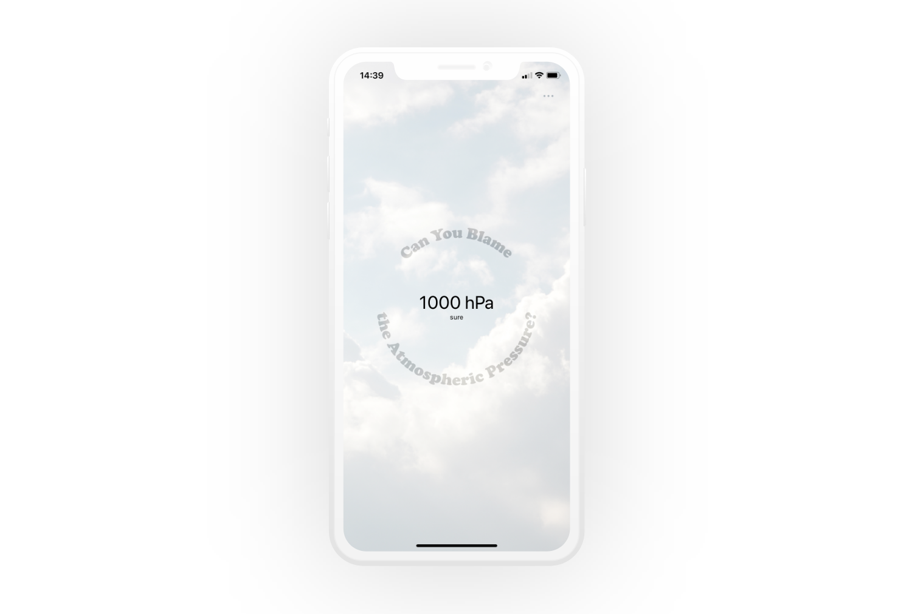

# ⏱️ Blame the Air Pressure
### Barometer - but make it fun

Anecdotal evidence shows that barometric pressure (too low or too high) can be the reason of headaches, making it a key element of any good small talk. And some studies[[1]](https://pubmed.ncbi.nlm.nih.gov/21921370/)[[2]](https://pubmed.ncbi.nlm.nih.gov/26702379/) confirm that too - but the research is limited.

This project, inspired by the before-mentioned phenomena in social interactions and the unexpected presence of an actual barometer inside of my mobile phone, is supposed to help answer one question: can you blame the atmospheric pressure today?

[One study](https://pubmed.ncbi.nlm.nih.gov/21921370/) found that 
> The frequency of migraine increased when the difference in barometric pressure from the day the headache occurred to the day after was lower by more than 5 hPa, and decreased when the difference in barometric pressure from the day the headache occurred to 2 days later was higher by more than 5 hPa.
(Kimoto K, Aiba S, Takashima R, et al. Influence of barometric pressure in patients with migraine headache. Intern Med. 2011;50(18):1923-1928. doi:10.2169/internalmedicine.50.5640)

and the conclusion of [another](https://pubmed.ncbi.nlm.nih.gov/26702379/) was that
>Small decreases of 6-10 hPa relative to the standard atmospheric pressure of 1013 hPa induced migraine attacks most frequently in patients with migraine. 
Okuma H, Okuma Y, Kitagawa Y. Examination of fluctuations in atmospheric pressure related to migraine. Springerplus. 2015;4:790. Published 2015 Dec 18. doi:10.1186/s40064-015-1592-4

The app measures the air pressure with the built in barometer (or gets the data from the nearest weather station if the barometer isn't present), compares it with the normal pressure of 1013 hPa, and gives the verdict. If the difference is smaller than 5 hPa, the reason is probably something else.

#### Installation
Get the APK from the [release section](https://github.com/tusindfryd/perfect-places/releases) to try it out on your Android device or install Expo by `npm install --global expo-cli`, clone the repository, and launch the project by `expo start`. You might need to get the API key from [Open Weather](https://openweathermap.org/api) to build the project and test it on your device if it's not equipped with a built-in barometer.

#### Screenshot

#### Credits
Icon by [Murat Kalkavan](https://dribbble.com/muratkalkavan) from [Icons8](https://icons8.com/)
Background by [Miguel Á. Padriñán](https://www.pexels.com/pl-pl/@padrinan) from [Pexels](https://www.pexels.com/pl-pl/@padrinan)
Data from [Open Weather Map](https://openweathermap.org/)